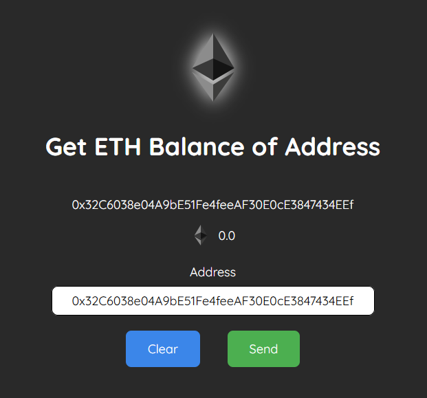

# Minimal Lit Elements Project for Fetching ETH/AVAX Balance

This is a minimal Lit Elements project that fetches the balance of an Ethereum or Avalanche address using the ethers.js library. This project demonstrates how to create a basic Lit Element project and fetch data from ethereum/avalanche blockchain.



## Prerequisites

To run this project, you will need:

* Node.js and npm installed on your machine.
* An Ethereum or Avalanche address that you want to check the balance of.

## Getting started

To get started, clone this repository to your local machine and navigate to the project directory in your terminal. Then, install the project dependencies by running:

``` bash
npm install
```

Then you can start the development server by running:

``` bash
npm start
```

This will start the development server and open the application in your default browser. You should see a simple form where you can enter an Ethereum or Avalanche address.

Enter the address you want to check the balance of and click the "Send" button. The balance of the address will be displayed on the screen.

You can also switch between Ethereum and Avalanche by clicking the network icon.

check out the [Lit Element documentation](https://lit-element.polymer-project.org/guide) for more information on how to build your own Lit Element project.
